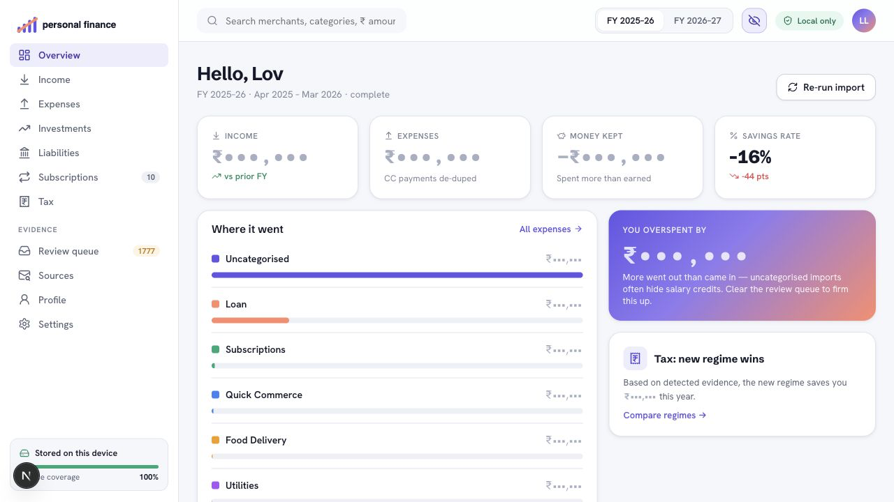
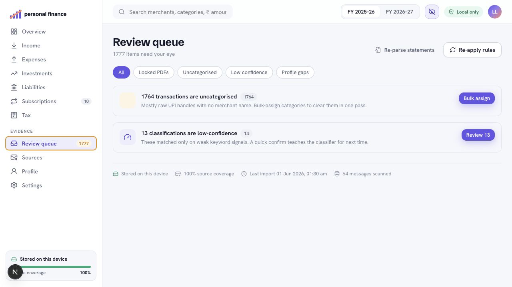
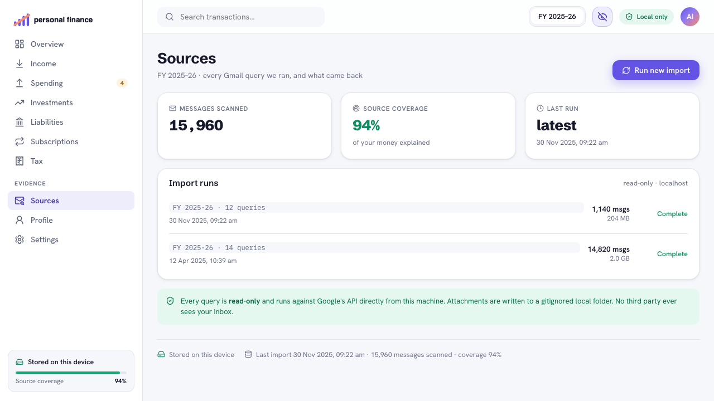

<p align="center">
  <picture>
    <source media="(prefers-color-scheme: dark)" srcset="public/assets/logo-wordmark-white.svg">
    <source media="(prefers-color-scheme: light)" srcset="public/assets/logo-wordmark.svg">
    
  </picture>
</p>

<p align="center">
  Local-first Gmail-backed personal finance workbench
</p>

<p align="center">
  Gmail readonly - encrypted SQLite - local MiniLM classification - India tax view - source provenance
</p>

<p align="center">
  
  
  
  
</p>

<p align="center">
  <a href="#what-it-does">What it does</a> -
  <a href="#how-it-works-30-seconds">How it works</a> -
  <a href="#get-started-60-seconds">Get started</a> -
  <a href="#model-based-classification">Classification</a> -
  <a href="#repo-layout">Repo layout</a>
</p>

---

`personal-finance` rebuilds a household ledger from financial evidence you
already receive in Gmail. It runs on your machine, uses your own read-only
Google OAuth client, downloads statements and receipts locally, and turns them
into categorized expenses, income, subscriptions, investments, liabilities,
India tax-regime comparisons, and source provenance.

This is not a SaaS app, account aggregator, or hosted finance product. The
database, attachments, profile, OAuth client, and tokens stay on your device.



Amounts are hidden with the app's built-in mask.

## What it does

- **Gmail import** - finds statement and receipt emails through your own
  `gmail.readonly` OAuth client.
- **Local parsing** - downloads attachments, decrypts supported PDFs, extracts
  text, parses statements, and de-duplicates overlapping rows.
- **Ledger workbench** - shows income, expenses, investments, liabilities,
  subscriptions, taxes, review queue, sources, profile, and settings.
- **Conservative classification** - combines deterministic rules with local
  MiniLM suggestions learned from review feedback.
- **Source provenance** - keeps links from rollups and transactions back to the
  imported evidence.
- **India tax view** - compares FY 2025-26 / 2026-27 old and new regime
  outcomes from detected evidence.

## How it works (30 seconds)

```text
Gmail inbox
  (statements, receipts, tax evidence)
        |
        v
+--------------------------------------------------+
| personal-finance                                 |
|                                                  |
| Read-only Gmail queries -> attachments/          |
| PDF unlock + text extraction -> parsed docs      |
| Provider parsers -> transactions                 |
| Deterministic classifier -> local ML suggestions |
| Review feedback -> encrypted local model state   |
|                                                  |
| SQLCipher DB + local files only                  |
+--------------------------------------------------+
        |
        v
Workbench dashboard + provenance links
```

- **Profile signals** scope Gmail queries, password candidates, salary/rent/EMI
  detection, tax evidence, and classification context.
- **Drizzle migrations** maintain the encrypted SQLite schema.
- **Re-ingestion is idempotent** with deterministic per-attachment document ids.
- **Transfers are de-duped** so credit-card payments and self-transfers do not
  inflate income or expense rollups.

## Get started (60 seconds)

Requirements: Node.js 20 or newer, npm, and a Google account whose Gmail
contains the statements and receipts you want to import. `qpdf` is optional for
unusual password-protected PDFs.

```sh
# 1 - Install dependencies
npm install

# 2 - Load India pack data
npm run db:load-packs

# 3 - Start the local workbench
npm run dev
```

Open <http://127.0.0.1:3000>. A fresh install routes to `/onboarding`:

1. Enter essentials: name, PAN, date of birth, employer, primary bank, and
   credit card issuer.
2. Create a Google Cloud Desktop OAuth client, enable the Gmail API, and paste
   the downloaded client JSON into the app.
3. Connect Gmail with the `gmail.readonly` scope. The app can read matching
   messages, but cannot send, delete, or modify mail.
4. Review the financial-year import estimate. Downloads over the 1 GB consent
   threshold require explicit approval.
5. Import statements and receipts. Attachments are stored under `attachments/`,
   parsed, classified, and indexed locally.

After onboarding, the workbench opens the overview dashboard with provenance
links back to imported evidence.

## Review and provenance

| Review queue | Sources |
| --- | --- |
|  |  |

## Model-Based Classification

Classification starts with deterministic rules, then uses the local model only
where it can safely improve weak results.

- The deterministic classifier runs first across provider rules, merchant
  aliases, profile signals, recurrence, internal-transfer detection, and
  project isolation.
- Local ML is eligible only for fallback, low-confidence, or review-required
  transactions. Strong deterministic matches remain deterministic.
- Transfers, tax evidence, project-isolated rows, and internal-transfer
  de-duplication are intentionally kept out of model auto-classification.
- The embedding model is bundled locally at
  `models/classification/all-MiniLM-L6-v2` and runs through ONNX Runtime. No
  transaction text is sent to an external model service.
- User review actions create feedback examples with MiniLM embeddings. Those
  examples train a local softmax classifier head stored in the encrypted local
  database.
- Strong predictions can be accepted as `local_ml` layer-10 classifications.
  Weaker predictions are stored as review suggestions so the user can accept,
  reject, or override them.
- If the model bundle or runtime is unavailable, the app falls back to the
  deterministic classifier and review queue.

The result is a conservative loop: deterministic rules handle known cases,
review feedback teaches the local model, and provenance still records why each
classification happened.

## Local data privacy

| Data | Where it lives | Notes |
| --- | --- | --- |
| Gmail access | Your Google OAuth client | Read-only `gmail.readonly` scope |
| Ledger database | `data/` | SQLCipher-encrypted SQLite |
| OAuth tokens | Encrypted database | Sealed before storage |
| Attachments | `attachments/` | Gitignored local files |
| Exports | `exports/` | Gitignored generated artifacts |
| Profile and OAuth config | `secrets/` | Gitignored local setup |

There is no telemetry, hosted backend, or external enrichment API. Sensitive
values are masked in the UI by default.

## Backup and recovery

The database key is generated on first run and stored only in your OS keychain
— you have never seen it, and backup files are unreadable without it. A real
backup therefore has two parts:

1. **Snapshot** — `POST /api/settings/backup` writes a consistent encrypted
   copy to `exports/`. Copy it off this machine.
2. **Passphrase escrow** — save the key in your password manager. macOS:

   ```sh
   security find-generic-password -s personal-finance -a db-passphrase -w
   ```

Restore order matters: on a new machine, put the escrowed passphrase into the
keychain **before** first launch, then copy the snapshot to
`data/personal-finance.db`. Starting the app first generates a fresh key that
cannot open the old database. Full procedure and failure modes:
`.claude/skills/backup-and-recovery/SKILL.md`.

## CLI

The guided browser onboarding flow is the recommended path for new users. These
scripts are useful for repeatable local setup, debugging, pack maintenance, and
developer workflows.

```sh
npm run dev                    # start 127.0.0.1:3000
npm run build                  # create production build
npm start                      # serve production build
npm run lint                   # run ESLint
npm test                       # run the full test suite
npm run validate:packs         # validate packs/in JSON
npm run eval:classifier        # classifier accuracy scorecard (golden set)
npm run eval:ledger            # ledger data-quality metrics
npm run profile:seed           # load secrets/profile.local.json
npm run gmail:auth             # authorize read-only Gmail from CLI
npm run gmail:fetch -- --fy=2025-26 [--all] [--yes]
npm run ingest                 # parse, classify, and index attachments
```

Advanced users can maintain `secrets/profile.local.json` directly. Its shape is
defined in `src/profile/types.ts`.

Optional local assistant endpoints can synthesize typed ledger answers with a
localhost Ollama model. The deterministic typed-tool answer remains available
when Ollama is not running or the configured model is missing.

## Current capabilities

| Area | Status |
| --- | --- |
| Storage | Encrypted local SQLite with Drizzle migrations |
| Packs | India institutions, card issuers, brokers, insurers, lenders, merchants, Gmail templates |
| Gmail | Read-only query building, estimation, consent gate, attachment download |
| PDFs | Password candidates, pdf.js extraction, OCR support, optional `qpdf` fallback |
| Parsing | Provider-dispatched statements plus universal bank/card fallbacks |
| Classification | Deterministic pipeline plus local MiniLM suggestions |
| Ledger | Income, expense, subscription, investment, liability, tax, source rollups |
| Re-ingestion | Idempotent document ids and cross-statement de-duplication |
| Assistant | Typed ledger tools with optional localhost Ollama synthesis |
| Quality | Golden-set classifier eval and ledger data-quality scorecard (`evals/`) |

## Repo layout

| Path | Purpose |
| --- | --- |
| `app/` | Pages and route handlers |
| `app/api/` | Setup, OAuth, Gmail import, profile, dashboard, review, assistant APIs |
| `src/ui/` | Shell, onboarding, primitives, page components, contexts, data hooks |
| `src/db/` | Drizzle schema, SQLCipher connection, migrations |
| `src/classifier/` | Deterministic transaction classification pipeline |
| `src/intelligence/` | MiniLM embedding runtime, softmax head, feedback, predictions, suggestions |
| `src/assistant/` | Typed query selection and optional Ollama synthesis |
| `src/gmail/` | OAuth, query builder, fetcher, consent gate |
| `src/pdf/` | Password candidates, unlock support, text extraction, OCR |
| `src/parsers/` | Provider-dispatched statement parsers |
| `src/profile/` | Profile seed schema, persistence, signal adapters |
| `src/ingest/` | Attachment-to-ledger orchestration |
| `src/ledger/` | Financial-year helpers and dashboard rollups |
| `models/classification/` | Bundled local classifier embedding model assets |
| `packs/in/` | India pack seed data |
| `schemas/` | Pack validation schemas |
| `evals/` | Classifier golden-set and ledger data-quality scorecards |
| `docs/` | Load-bearing decisions (`DECISIONS.md`), goal backlog (`GOALS.md`), plans/specs |
| `tools/`, `scripts/`, `tests/` | Validation tools, operational scripts, automated tests |

## For contributors and AI agents

Engineering guidance lives in-repo and is written to be agent-agnostic:

- `AGENTS.md` — entry point for any coding agent: skill index, non-negotiable
  invariants, common errors with fixes.
- `CLAUDE.md` — architecture, commands, and conventions.
- `.claude/skills/` — nine workflow runbooks (schema/migrations, DB tests,
  parsers, classifier, misclassification debugging, local-ML guardrails,
  packs, verification, backup/recovery), each anchored to a real incident
  from this repo's history.
- `docs/DECISIONS.md` — the product principles and load-bearing technical
  decisions; read before proposing structural changes.
- `docs/GOALS.md` — the backlog: self-contained project briefs with
  eval-based acceptance criteria.
